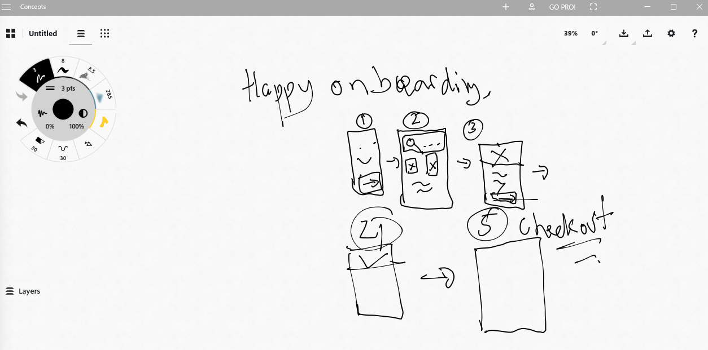
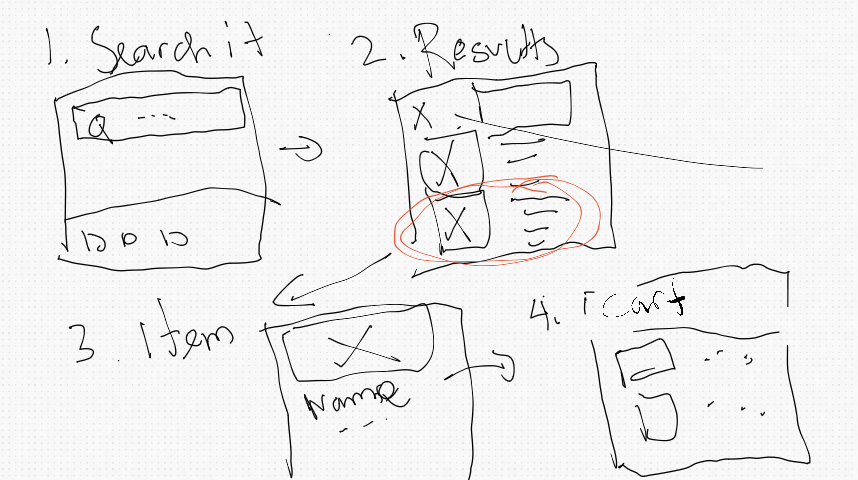
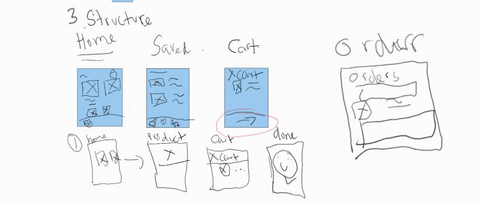
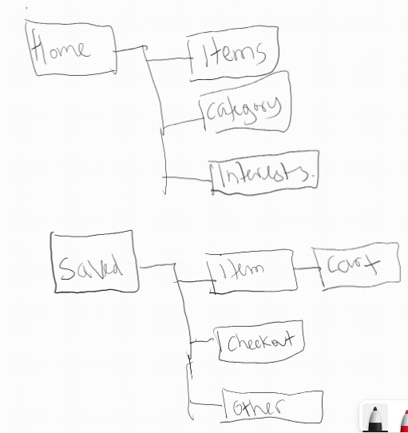

# design-library
Hi everyone and future-me!

Welcome to this repository. So this is a note / reference also as a journal for me to learn about design. 

So Let's get started!

# Meeting The Client
Idea: 
- Solve their problems!
- Make their life easier!

Two Projects: 
- Project A: Follow Along the tutorial: an app to beat Amazon!
- Project B: My own product. I'm still thinking about it. 
  But maybe it's for `restourant stock` dashboard for one of my client or 
  `pogi user` for the other client. Let's decide it later. 

Iteration Step: 

(Note: the iteration step could overflow to each other. This is just a guidelines)
- Planning Phase 
  - How should it look, feel, and do
  - What's the user's goal? How to achieve it using the product
- Design Phase 
  - Turn the idea into a design. 
- Development Phase
  - Turn the design into product 
- Launch Phase
  - We deliver the product to the user
- Post-Launch Phase
  - Hand over the product to the client 

Jobs:
- Designer: Planning, Design & Post-Launch
- Developer: Development, Launch & Post-Launch

Skills for designer: 
- Graphic Design: Colors, Layout, Typography, Imagery. It's the visual!
- User Experience: UX/UI
- Goal Conversion: Drives the result that the client wants!
- Platform Development: Mobile/Web? 

## Learning Resources from ZTM
Here's the learning resources: [link](https://danielschifano.notion.site/Complete-Web-Mobile-Designer-Resources-d1d9b6868a7746ffb3b6f02703ac7724)

[ZTM Sketching Resources](https://www.figma.com/file/goN3nuKQZsyiKrnrDI4Xtl/00.-Sketching-Resource?node-id=0%3A1&mode=dev)

Several others: 
- [goodUI](https://goodui.org/): AB Test
- [awwards.com](https://www.awwwards.com/): Inspiration
- [behance](https://www.behance.net/): Inspiration
- [flaticon](https://www.flaticon.com/): Icon
- [nonproject](https://thenounproject.com/): Icon
- [image](https://unsplash.com/): Image

We don't have to start from the scratch. We can use online tools. 

# Getting Started
## Sketching
Sketching is a two step process:
- Idea generation: Generate => Sketch
- Adding detain refinement: Add Detail => Refine

From Idea => Wireframes => Components 

The sketching process: 
- Step 1: Be prepared 
  - What are your goals? 
  - Who is your audience? 
  - Time yourself. Just time box yourself
- Step 2: Ready, Set ... Go!
  - Draw a frame for your device: mobile? Web? 
  - Start with a more simple and redundant elements: Header? Footer? 
  - then move onto some more detailed interactions 
  - annotate your sketches and keep them safe. 
  - Keep going: Built an alternative:
  - Share your sketches
- Step 3: Refinement
  - Add titles to your sketches 
  - Add annotations again ... 
  - Use numbers, numbering your sketches. 
  - Use arrows 
  - Add gestures if you want. 

### Sketching User Flows
You can sketch using tablets, an a free application called concepts. 
In this practice, I'm using drawing tables, and `concepts` app in the Windows store.
Or just using Microsoft Whiteboard is fine. 
I'm using Microsoft Whiteboard for this practice, here's the [link](https://wbd.ms/share/v2/aHR0cHM6Ly93aGl0ZWJvYXJkLm1pY3Jvc29mdC5jb20vYXBpL3YxLjAvd2hpdGVib2FyZHMvcmVkZWVtLzA4Y2MyMTIzMzZhOTQzMjk5OTcxYTk5ZmRiYTkyNjhmX0JCQTcxNzYyLTEyRTAtNDJFMS1CMzI0LTVCMTMxRjQyNEUzRF85YWZjNTg4ZC1hYTZjLTQwNDctYTJmYi1kZWQxZTQ3Mzc2YmE=)

- Map the overall flow
  This is my sketch. Lol. So overall, map the overall flow. So just map it the overall flow. 
  
- Specific user flow
  
- We also need to sketch several alternative for user flow. Whether it's for example how the user access the item / product page, from home page or from search page. So basically the flow. 
- Example: Navigation Scheme
  
  
- Sketching Screen States
  

### Tips
- Don't worry to be messy. It's just a sketch, we can refine it late. Be lean, agile. 
- All you need: squares, rectangles, circles. 
- Keep them saved. I'd like to use Microsoft Whiteboard. 
- Please communicate your sketch. 

## Inspiration
How to stay inspired? 
- Remember: Creativity is like a muscle! If you don't use it! You're kind of lose it. 
  - You need to constantly stimulate your creativity!
  - Talk to your peers! 
  - Study others. 
  - Surround yourself with great design.  
  - Stay educated on a variety of topics. 
  - Design for yourself. 
  - Travel and explore the world. 
  - Take a walk. 
- Find inspiration online: 
  - [Dribble](https://dribbble.com/shots). The best place to get an idea for design. 
  - Pininterest 
  - [Behance](https://www.behance.net/)
  - [pttrns](https://www.pttrns.com/). It is paid. 
  - [awwards](https://www.awwwards.com/)
 
## User Flows
## Sitemaps

# Explore & Iterate
## Wireframes
## Prototyping
## Getting Feedback

# Visual Design
## Grids & Spacing
## Typography
## Forms + UI Elements
## Color
## imagery + Iconography
## Accessibility

# Design Exploration
## Design Patterns
## Mobile Design
## Applying Visual Design
## Motion
## Micro - Interactions

